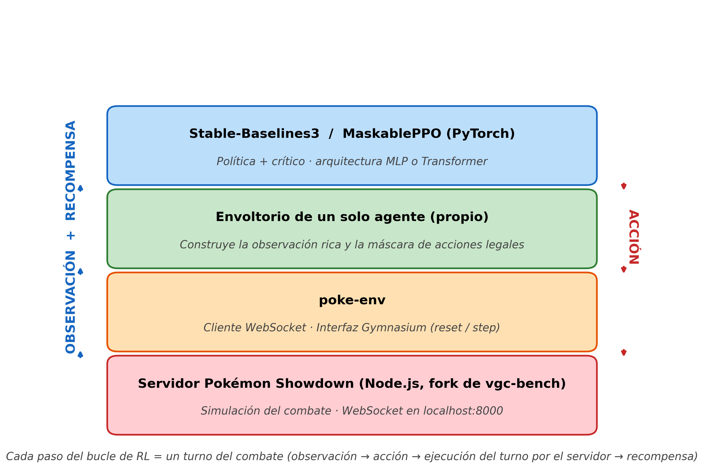

# DavidDiaz_TFG — Agente de aprendizaje por refuerzo para Pokémon VGC

Bot de inteligencia artificial que juega combates Pokémon, con especial atención al formato competitivo oficial de **dobles VGC**. Implementado en Python sobre **Stable-Baselines3** (MaskablePPO), **poke-env** y un servidor local de **Pokémon Showdown**.

Proyecto de Trabajo de Fin de Grado del Grado en Diseño y Desarrollo de Videojuegos (Especialidad de Programación) de la **Universidad de Diseño, Innovación y Tecnología (UDIT)**, curso académico 2025–2026.

> **Autor:** David Díaz Espinosa de los Monteros

---

## Tabla de contenidos

- [Qué hace](#qué-hace)
- [Arquitectura](#arquitectura)
- [Requisitos](#requisitos)
- [Instalación rápida](#instalación-rápida)
- [Uso básico](#uso-básico)
- [Estructura del proyecto](#estructura-del-proyecto)
- [Bibliotecas de terceros](#bibliotecas-de-terceros)
- [Distribución (binario)](#distribución-binario)
- [Documentación](#documentación)

---

## Qué hace

- Entrena agentes de aprendizaje por refuerzo (PPO con *action masking* mediante **MaskablePPO**) para combates Pokémon, en formatos **singles** y **dobles VGC**.
- Soporta dos arquitecturas de red comparables: un **perceptrón multicapa (MLP)** y un **extractor basado en atención (Transformer)**.
- Permite cuatro modalidades de oponente durante el entrenamiento:
  - `random` — jugador aleatorio (acciones legales).
  - `maxpower` — siempre el movimiento de mayor potencia base.
  - `heuristic` — `SimpleHeuristicsPlayer` de poke-env (reglas básicas de efectividad y cambio).
  - `self` — *self-play* (el rival usa la política actual del agente).
- Una vez entrenado, el agente puede aceptar desafíos en el simulador local o jugar en la ladder del servidor oficial `play.pokemonshowdown.com` (con cuenta registrada).
- Incluye utilidades para:
  - **Enfrentar dos modelos** entre sí o un modelo contra rivales de referencia: `battle_models.py`.
  - **Arrancar self-play** desde un modelo ya entrenado, sin sobrescribirlo: `selfplay_from.py`.
  - **Exportar las gráficas** de TensorBoard a PNG con etiquetas y ejes en español: `plot_metrics.py`.
  - **Añadir formatos VGC vigentes** al servidor adaptado: `patch_server_formats.py`.

---

## Arquitectura



Cuatro capas, de abajo a arriba: el servidor Pokémon Showdown (Node.js, en el fork de vgc-bench) simula los combates; **poke-env** se comunica con el servidor por WebSocket y expone el combate a través de la interfaz **Gymnasium**; un envoltorio propio convierte el entorno multiagente en uno de un solo agente y construye la observación detallada y la máscara de acciones legales; y, en la cima, **Stable-Baselines3 / MaskablePPO** sobre **PyTorch** entrena la política y el crítico.

---

## Requisitos

- **Python 3.10 – 3.13**
- **Node.js LTS** (para el servidor de Pokémon Showdown)
- **Git** (para clonar el proyecto y el servidor)

Opcional para acelerar el entrenamiento:

- **GPU NVIDIA** con CUDA (cualquier RTX 20xx, 30xx, 40xx; gráficas AMD o integradas Intel no sirven para CUDA).

---

## Instalación rápida

```bash
# 1) Proyecto + entorno virtual + dependencias de Python
git clone <URL_DEL_REPOSITORIO> DavidDiaz_TFG
cd DavidDiaz_TFG
python -m venv .venv
.venv\Scripts\activate
pip install -r requirements.txt

# 2) Servidor (Node.js)
git clone -b vgc-bench https://github.com/cameronangliss/pokemon-showdown.git
cd pokemon-showdown
npm i
node build
```

> Guía completa paso a paso desde cero, con PyTorch para GPU, instalación del software base y solución de problemas: [**INSTALACIÓN.txt**](INSTALACIÓN.txt).

---

## Uso básico

Arranca el servidor en una terminal y déjalo abierto:

```bash
cd pokemon-showdown
node pokemon-showdown start --no-security
```

En otra terminal, con el entorno virtual activado:

```bash
# Entrenar dobles VGC contra un oponente heurístico
python train_doubles.py --team teams/vgc/I1.txt --format gen9vgc2026regi --opponent heuristic --total_steps 500000

# Jugar contra el bot (acepta desafíos en http://localhost:8000)
python play.py --mode doubles --username MiBot --run_id 1 --team teams/vgc/I1.txt --format gen9vgc2026regi

# Enfrentar dos modelos
python battle_models.py --mode doubles --format gen9vgc2026regi --team teams/vgc/I1.txt --a mlp --b heuristic -n 50

# Ver el progreso del entrenamiento
tensorboard --logdir logs

# Exportar las gráficas a PNG
python plot_metrics.py
```

> Lista completa de comandos por temas (singles, transformer, self-play, evaluación, métricas, servidor oficial, depuración, etc.): [**COMANDOS.txt**](COMANDOS.txt).

---

## Estructura del proyecto

```
src/                            Código fuente propio (módulos importables)
├── singles_env.py              MySinglesEnv  — entorno de combates individuales
├── doubles_env.py              MyDoublesEnv  — entorno de combates dobles VGC
├── rl_wrapper.py               OpponentSamplingEnv — envoltorio de un solo agente
├── features.py                 Construcción de la observación detallada
├── policy.py                   Argumentos de política MLP y extractor Transformer
├── callbacks.py                WinRateCallback para TensorBoard
├── poke_env_patch.py           Parche de poke-env (Behemoth Blade / Bash)
└── teams.py                    Constructor de equipos para los entornos de dobles

train_singles.py, train_doubles.py   Scripts de entrenamiento
play.py                          Aceptar desafíos en local o jugar en ladder
battle_models.py                 Enfrentar dos modelos o uno contra baselines
selfplay_from.py                 Arrancar self-play desde un modelo entrenado
plot_metrics.py                  Exportar gráficas de TensorBoard
patch_server_formats.py          Añadir formatos VGC vigentes al servidor
test_env.py                      Test rápido del entorno

teams/                           Recursos: equipos en formato Pokémon Showdown
pokemon-showdown/                Código de terceros: servidor (no se distribuye)
models/                          Modelos entrenados (artefactos)
logs/                            Registros de TensorBoard (artefactos)
metrics/                         Gráficas exportadas (PNG)
replays/                         Repeticiones de combates (HTML)

requirements.txt                 Dependencias de Python
requirements.lock                Entorno verificado (versiones exactas)
INSTALACIÓN.txt                  Guía de instalación desde cero
COMANDOS.txt                     Comandos de uso diario
README.md                        Este archivo
.gitignore                       Exclusiones de Git
```

---

## Bibliotecas de terceros

| Biblioteca | Versión | Función en el proyecto |
|---|---|---|
| [poke-env](https://github.com/hsahovic/poke-env) | 0.15.0 | Cliente Python del servidor Pokémon Showdown. Mantiene el estado del combate y expone entornos compatibles con Gymnasium. |
| [Stable-Baselines3](https://stable-baselines3.readthedocs.io) | 2.7.1 | Implementación de los algoritmos de aprendizaje por refuerzo (PPO, A2C, etc.). |
| [sb3-contrib](https://sb3-contrib.readthedocs.io) | 2.7.0 | Extensión de Stable-Baselines3. Aporta **MaskablePPO** (PPO con enmascaramiento de acciones). |
| [PyTorch](https://pytorch.org) | 2.9.1 | Motor de cálculo para las redes neuronales. |
| [Gymnasium](https://gymnasium.farama.org) | 1.2.3 | Estándar de interfaz para entornos de aprendizaje por refuerzo. |
| [TensorBoard](https://www.tensorflow.org/tensorboard) | 2.20.0 | Visualización de las métricas de entrenamiento. |
| [matplotlib](https://matplotlib.org) | 3.10.9 | Exportación de las curvas de entrenamiento a PNG. |

Servidor de combates externo: fork de **Pokémon Showdown** mantenido por el proyecto [VGC-Bench](https://github.com/cameronangliss/pokemon-showdown), con correcciones de estabilidad en la gestión de salas y de los tiempos de espera respecto del servidor estándar.

---

## Distribución (binario)

El proyecto se distribuye en dos formatos complementarios, ambos reproducibles desde las fuentes con los scripts incluidos en `_build_release/`:

- **Paquete portable** (`DavidDiaz_TFG_portable.7z`) — Python embebido + `venv` con todas las dependencias + Node.js portable + servidor Pokémon Showdown compilado + modelos entrenados + lanzadores `.bat`. Se ejecuta sin instalar nada.
- **Instalador Windows** (`DavidDiaz_TFG_setup.exe`) — Inno Setup 6 sobre la carpeta anterior. Instala en `Program Files`, crea accesos directos en el menú Inicio y soporta desinstalación.

Reconstrucción desde las fuentes (desde la raíz del proyecto):

```powershell
# 1) Paquete portable
powershell -ExecutionPolicy Bypass -File _build_release\build_portable.ps1

# 2) Instalador Windows (encima del portable)
& "C:\Program Files (x86)\Inno Setup 6\ISCC.exe" _build_release\setup.iss
```

Salida: `_build_release\dist\DavidDiaz_TFG_portable.7z` y `_build_release\dist\DavidDiaz_TFG_setup.exe`. Consulta `_build_release/README.md` para el detalle de flags y requisitos.

---

## Documentación

| Documento | Descripción |
|---|---|
| [`INSTALACIÓN.txt`](INSTALACIÓN.txt) | Guía paso a paso de instalación desde cero. |
| [`COMANDOS.txt`](COMANDOS.txt) | Listado completo de comandos por temas, con ejemplos. |
| `Memoria_TFG_David_Diaz.pdf` | Memoria del Trabajo de Fin de Grado (cuerpo principal). |
| `Anexo_A_Documentacion_del_codigo.pdf` | Anexo A: componentes, bibliotecas, clases, requisitos y estructura del proyecto. |
| `Anexo_B_Manual_de_usuario.pdf` | Anexo B: manual de usuario tipo producto. |

---

## Licencia y uso

Trabajo académico de Fin de Grado. El **código propio** del proyecto está disponible para uso académico y consulta. Las bibliotecas de terceros conservan sus respectivas licencias originales, listadas en el Anexo A.

Pokémon, Pokémon VGC y los nombres de criaturas, movimientos y mecánicas son propiedad de **The Pokémon Company / Nintendo / Game Freak**. Este proyecto no está afiliado ni respaldado por ellos.
